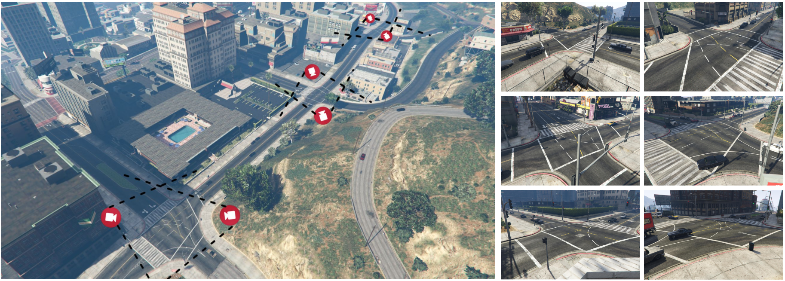

# MC-GTA: A Synthetic Benchmark for Multi-Camera Vehicle Tracking

This repo contains the code for generating Multi-Camera Vehicle Tracking scenarios in GTA V as explained in [MC-GTA: A Synthetic Benchmark for Multi-Camera Vehicle Tracking](https://zenodo.org/record/8335397), presented at [ICIAP 2023](https://sites.google.com/view/iciap-2023).

This is a modified version of a GTA-V mod tool, _DatasetCreator.asi_ (originally proposed [here](https://github.com/koehlp/MTA-Mod)), able to automatically draw, record, and save vehicles bounding box and other metadata to support research community of ITS (Intelligent Transportation Systems) creating synthetic datasets for Multi-Camera Vehicle Tracking.

## Running Instructions FunctionToolbox
 - Start this mod by pressing F5
 - Fly around to take a desired camera view with the player by activating Fly mode. Move up by pressing E and down by Q.

## Running Instructions DatasetCreator
 - Start this mod by pressing F6
 - Add camera view through displayed menu. This view will be appended to MTMCT/cameraSettings.csv
 - Set registration duration through "iteration" in MTMCT/parameters.txt
 - Click "Draw Vehicles 2d BBs" on Menu in order to have a preview of bounding box that will be generated. Press F9 to move between cameras
 - Having set up the cameras, start the recording by pressing F9. (TO REVIEW)
 - Stop the recording by holding F10. (TO REVIEW)

## Contacts
- Luca Ciampi - luca.ciampi@isti.cnr.it
- Nicola Messina - nicola.messina@isti.cnr.it
- Gaetano Emanuele Valenti - g.valenti10@studenti.unipi.it

## Acknowledgements
The basis of the developed code is from https://github.com/koehlp/MTA-Mod
